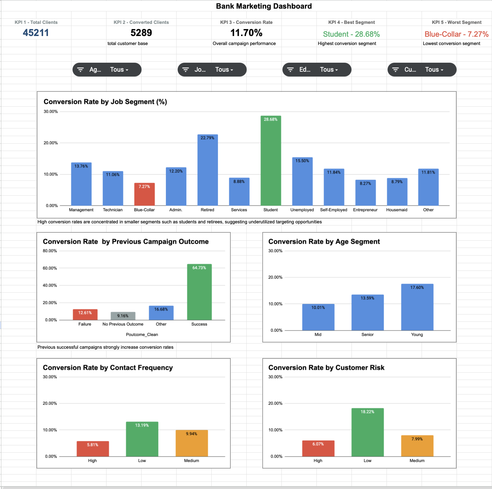
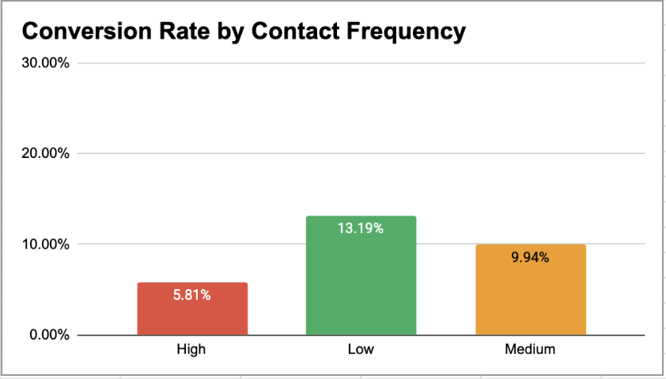

# 📊 Bank Marketing Campaign Analysis (Google Sheets)

---

## 🚀 Project Summary

This project analyzes a bank marketing campaign dataset to uncover **key drivers of customer conversion**.

👉 While the overall conversion rate is **11.70%**, deeper analysis reveals **strong disparities across customer segments**, campaign history, and contact strategy.

The objective is to move from a **mass marketing approach** to a **data-driven CRM strategy**, improving both **conversion performance** and **campaign efficiency**.

---

## 🏦 Business Context

Banks rely heavily on outbound campaigns (calls, emails) to promote financial products.

However, these campaigns often suffer from:

- Low conversion rates
- Over-contacting customers
- Poor segmentation strategies

👉 This project aims to identify:

- Who converts (and why)
- What reduces conversion
- How to optimize targeting and communication

---

## 🎯 Objectives

- Analyze overall campaign performance
- Identify high-performing customer segments
- Evaluate the impact of previous interactions
- Measure the effect of contact frequency
- Provide actionable CRM and marketing recommendations

---

## 📊 Data Overview

The dataset contains:

- **45,211 customers**
- **5,289 converted clients**
- Overall conversion rate: **11.70%**

### Key variables:
- Demographics: Age, Job, Education
- Campaign interactions: Contact frequency, previous outcome
- Customer profile: Risk level
- Target variable: Conversion (Yes/No)

---

## 🧹 Data Cleaning & Feature Engineering

To ensure consistency and usability:

- Standardized job categories → `Job_Clean`
- Simplified campaign outcomes → `Poutcome_Clean`
- Created `Customer_Risk` segmentation (Low / Medium / High)
- Aggregated metrics using pivot tables
- Calculated conversion rate:
# 📊 Bank Marketing Campaign Analysis (Google Sheets)

---

## 🚀 Project Summary

This project analyzes a bank marketing campaign dataset to uncover **key drivers of customer conversion**.

👉 While the overall conversion rate is **11.70%**, deeper analysis reveals **strong disparities across customer segments**, campaign history, and contact strategy.

The objective is to move from a **mass marketing approach** to a **data-driven CRM strategy**, improving both **conversion performance** and **campaign efficiency**.

---

## 🏦 Business Context

Banks rely heavily on outbound campaigns (calls, emails) to promote financial products.

However, these campaigns often suffer from:

- Low conversion rates
- Over-contacting customers
- Poor segmentation strategies

👉 This project aims to identify:

- Who converts (and why)
- What reduces conversion
- How to optimize targeting and communication

---

## 🎯 Objectives

- Analyze overall campaign performance
- Identify high-performing customer segments
- Evaluate the impact of previous interactions
- Measure the effect of contact frequency
- Provide actionable CRM and marketing recommendations

---

## 📊 Data Overview

The dataset contains:

- **45,211 customers**
- **5,289 converted clients**
- Overall conversion rate: **11.70%**

### Key variables:
- Demographics: Age, Job, Education
- Campaign interactions: Contact frequency, previous outcome
- Customer profile: Risk level
- Target variable: Conversion (Yes/No)

---

## 🧹 Data Cleaning & Feature Engineering

To ensure consistency and usability:

- Standardized job categories → `Job_Clean`
- Simplified campaign outcomes → `Poutcome_Clean`
- Created `Customer_Risk` segmentation (Low / Medium / High)
- Aggregated metrics using pivot tables
- Calculated conversion rate: `Conversion Rate` = `Converted` / `Total Customers`

---

## ⚙️ Methodology

This project follows a segmentation-driven analytical approach:

1. Define key KPIs (conversion, segments)
2. Segment customers across multiple dimensions:
   - Job
   - Age
   - Risk
   - Campaign history
   - Contact frequency
3. Compare conversion rates across segments
4. Identify high-performing vs underperforming groups
5. Translate insights into business recommendations

---

## 📈 Key KPIs

- **Total Clients:** 45,211  
- **Converted Clients:** 5,289  
- **Conversion Rate:** 11.70%  

### 🟢 Best Segment:
- **Student — 28.68%**

### 🔴 Worst Segment:
- **Blue-Collar — 7.27%**

---

## 📸 Dashboard Preview

### 🔹 Full Dashboard Overview

### 🔹 Conversion by Job Segment

### 🔹 Campaign Outcome Impact

### 🔹 Contact Frequency Impact

### 🔹 Customer Risk Analysis

---

## 🔍 Key Insights

### 1. Conversion is highly segment-driven

- Student: **28.68%**
- Retired: **22.79%**
- Blue-Collar: **7.27%**

👉 Gap of **21.41 points** between best and worst segments

---

### 2. Previous campaign success is the strongest driver

- Success: **64.73%**
- No previous outcome: **9.16%**

👉 Customers with prior success convert **~7x more**

---

### 3. Over-contacting reduces conversion

- Low contact: **13.19%**
- High contact: **5.81%**

👉 Conversion drops by more than half with excessive contact

---

### 4. Customer profile matters

**Age:**
- Young: **17.60%**
- Mid: **10.01%**

**Risk:**
- Low risk: **18.22%**
- High risk: **6.07%**

---

## 🚨 Key Business Problem

The current campaign strategy is:

- Too broad
- Too frequent
- Not personalized enough

👉 Result:
- Wasted effort
- Lower conversion efficiency
- Missed high-value opportunities

---

## 💡 Recommendations

### 🎯 1. Focus on high-performing segments
- Students
- Retirees
- Low-risk customers

---

### 🔁 2. Leverage previous campaign success
- Implement retargeting strategies
- Build customer lifecycle campaigns

---

### 📉 3. Reduce contact frequency
- Avoid campaign fatigue
- Optimize timing and messaging

---

### 🧠 4. Shift to a data-driven CRM approach
From:
❌ Mass marketing  
To:
✅ Segmented & personalized campaigns  

---

## 🧩 Personal Insight

With a background in:

- Linguistics  
- Customer interaction  
- Data analysis  

I approach conversion as more than a metric — it reflects:

- Communication quality  
- Customer perception  
- Trust built over time  

👉 From a linguistic perspective:
- Over-contacting creates "noise"
- Poor segmentation reduces message relevance
- Previous success builds a "conversation memory"

This aligns directly with CRM best practices:
👉 Right message, right time, right customer

---

## 🏁 Final Takeaway

👉 Conversion is not random — it is predictable.

And more importantly:

👉 It is **optimizable through better segmentation, smarter targeting, and controlled communication strategy**

---

## 🔗 Project Access

📊 Dashboard:

💻 GitHub:  
 

