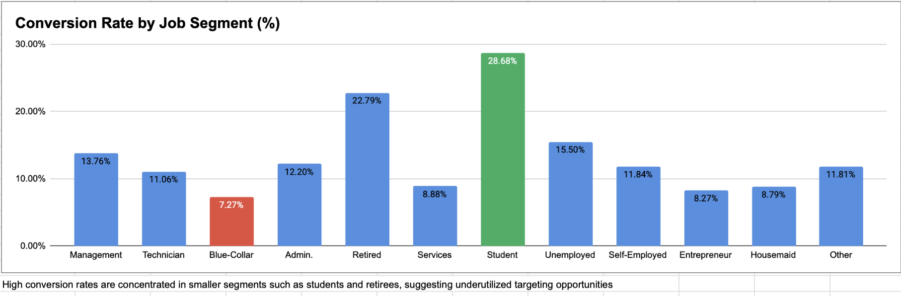
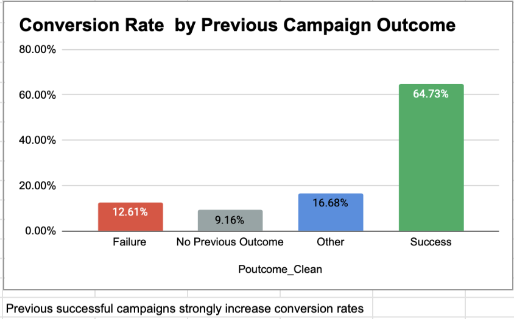
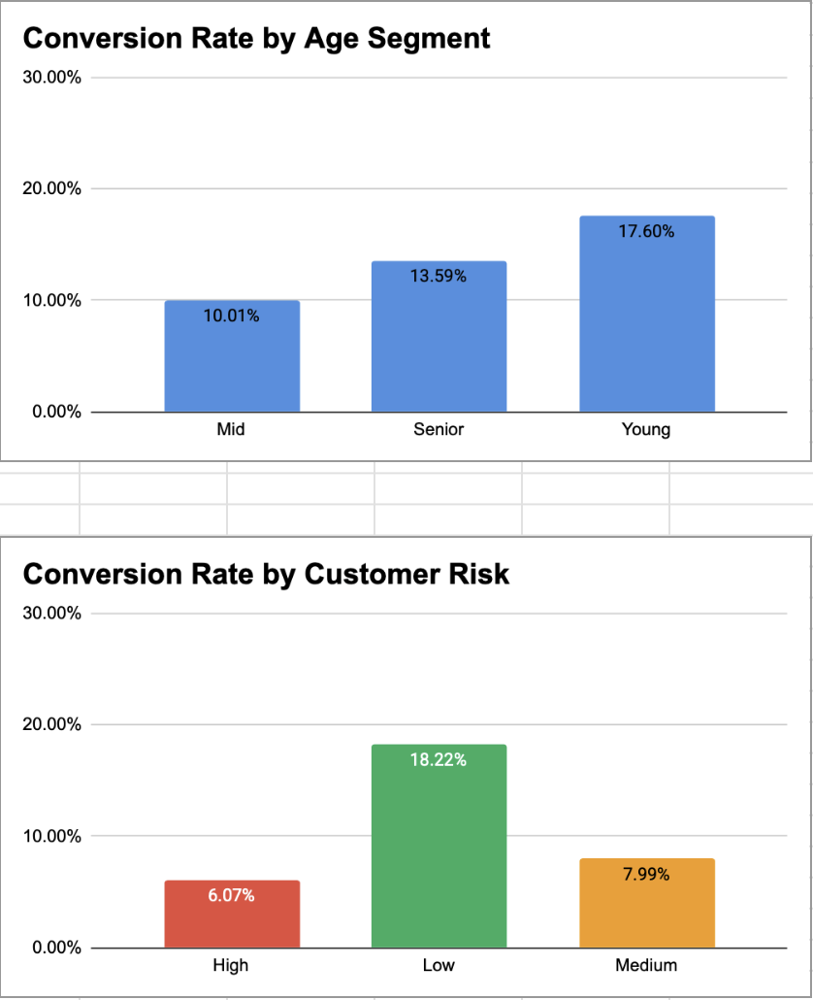

# 📊 Bank Customer Conversion & CRM Analysis (Google Sheets)

---

## 🚀 Project Summary

This project analyzes a bank marketing dataset (45,211 clients) to understand how **customer segmentation, campaign history, and contact strategy** impact conversion performance.

👉 Key objective:
Move from **mass marketing → data-driven CRM strategy**

While the overall conversion rate is **11.70%**, deeper analysis reveals strong disparities between segments, highlighting clear opportunities for optimization.

---

## 📌 Business Context

Banks rely on outbound campaigns (calls, emails) to promote financial products.

However:
- Campaigns are often too broad
- Customers are over-contacted
- Segmentation is underutilized

👉 The challenge:
How to improve conversion while reducing unnecessary outreach?

---

## 🎯 Objectives

- Analyze campaign performance
- Identify high-value customer segments
- Evaluate impact of:
  - Previous campaign outcomes
  - Contact frequency
  - Demographics (job, age, risk)
- Translate insights into actionable CRM strategies

---

## 📊 Data Overview

- Total Clients: **45,211**
- Converted Clients: **5,289**
- Conversion Rate: **11.70%**

---

## 📈 Dashboard Overview

---

## 📊 Key Metrics (KPI)

- **Total Clients:** 45,211  
- **Converted Clients:** 5,289  
- **Conversion Rate:** 11.70%  
- **Best Segment:** Student (**28.68%**)  
- **Worst Segment:** Blue-Collar (**7.27%**)

---

## 📊 Key Analysis

### 1. Conversion Rate by Job Segment

- Student: **28.68%**
- Retired: **22.79%**
- Blue-Collar: **7.27%**

👉 Insight:
High-performing segments are **smaller but significantly more responsive**

---

### 2. Impact of Previous Campaign Outcome

- Success: **64.73%**
- Failure: **12.61%**
- No previous outcome: **9.16%**

👉 Insight:
Customer interaction history is the **strongest predictor of conversion**

---

### 3. Contact Frequency Effect

- Low: **13.19%**
- Medium: **9.94%**
- High: **5.81%**

👉 Insight:
Excessive contact leads to **campaign fatigue and lower conversion**

---

### 4. Customer Profile Analysis

**Age:**
- Young: **17.60%**
- Senior: **13.59%**
- Mid: **10.01%**

**Risk:**
- Low: **18.22%**
- Medium: **7.99%**
- High: **6.07%**

👉 Insight:
Customer profile strongly influences conversion probability

---

## 🧠 CRM & Business Perspective

This project reflects real-world CRM challenges:

- Customer behavior is influenced by past interactions
- Over-contacting reduces engagement
- Targeting quality matters more than campaign volume

👉 Key takeaway:
Conversion is driven by **precision, not scale**

---

## 💡 Business Recommendations

### 🎯 Improve Targeting
Focus on:
- Students
- Retirees
- Low-risk customers

---

### 📉 Reduce Campaign Pressure
- Limit high-frequency contacts
- Optimize timing instead of volume

---

### 🔁 Leverage Campaign History
- Retarget previous successful customers
- Personalize follow-ups

---

### 🧠 Shift to Data-Driven CRM
Move from:
❌ Mass campaigns  
✅ Targeted strategies based on behavior

---

## 🧩 Personal Insight

With a background in **linguistics, customer interaction, and data analysis**, I approached this project as both a data and communication problem.

Customer conversion reflects:
- Trust built through interactions
- Sensitivity to communication frequency
- Importance of relevant messaging

👉 This mirrors real CRM dynamics, where performance depends on:
- Timing
- Personalization
- Customer understanding

---

## 🛠 Tools Used

- Google Sheets
- Pivot Tables
- Data Cleaning & Feature Engineering
- Dashboard Design

---
