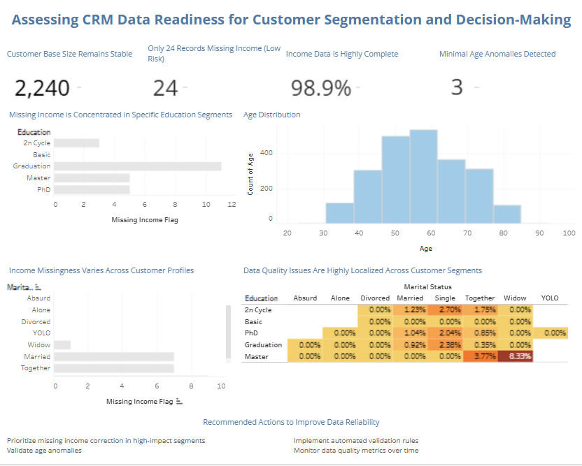
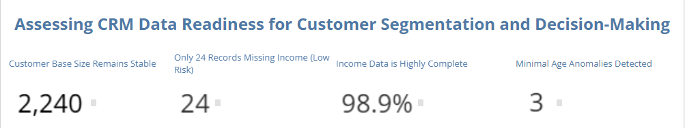
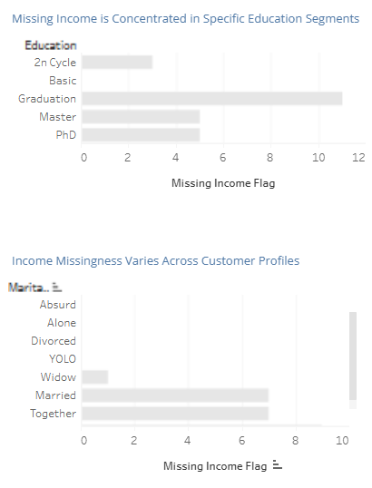
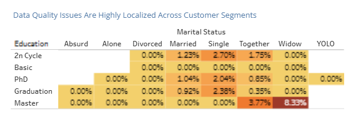

# 📊 CRM Data Quality & Readiness Analysis (Tableau)

## 🚀 Project Summary

This project evaluates whether a CRM dataset is reliable enough for **customer segmentation and business decision-making**.

The objective is not only to visualize data, but to assess:
- Data completeness  
- Data consistency  
- Distribution of data quality issues across segments  

👉 **Key finding:**  
The dataset is highly reliable overall, with only minor and localized data quality issues.

---

## 📌 Business Context

Customer segmentation depends heavily on data quality.

Incomplete or inconsistent data can:
- distort targeting strategies  
- reduce campaign effectiveness  
- lead to poor business decisions  

This project answers a critical question:

👉 *“Is this dataset reliable enough to be used for segmentation?”*

---

## 🎯 Objectives

- Evaluate overall data quality  
- Detect missing or inconsistent values  
- Identify high-risk customer segments  
- Analyze how data issues are distributed  
- Provide actionable business recommendations  

---

## 📊 Data Overview

The dataset represents a CRM customer base and includes:

- Demographics (Age, Education, Marital Status)  
- Income data  
- Behavioral attributes

---

## 🔗 Live Dashboard
[View Dashboard](https://public.tableau.com/views/CRMDataQualityDashboard/Dashboard1?:language=en-US&:sid=&:redirect=auth&:display_count=n&:origin=viz_share_link)

---

## 📊 Key Metrics

- **Total Customers:** 2,240  
- **Missing Income Records:** 24  
- **Income Completeness:** 98.9%  
- **Age Anomalies:** 3  

👉 Initial assessment:  
The dataset shows **strong overall quality and consistency**

---

## 📊 Analysis

### Dashboard Overview

---

### KPI Summary

---

### Segmentation Analysis

---

### Data Quality Heatmap

---

## 🔍 Key Insights

- The dataset is **globally reliable**, with very high completeness  
- Missing income affects only **1.1% of records (24 / 2,240)**  
- Data issues are **not randomly distributed**, but concentrated in specific segments  
- Certain combinations of education and marital status show higher missing rates  
- Most segments show **near-zero data issues**  

👉 Data quality issues are **localized, not systemic**

---

## 🚀 Business Recommendations

- Prioritize missing income correction in high-impact segments  
- Validate age anomalies  
- Implement automated validation rules  
- Monitor data quality metrics over time  

---

## 🎯 Key Takeaways

- The dataset is **reliable for segmentation and decision-making**  
- Data issues are **localized and manageable**  
- Targeted cleaning is more efficient than full dataset correction  

👉 Data quality should be evaluated not only by volume, but by **distribution across segments**

---

## 🛠️ Tools Used

- Tableau (Dashboard & Visualization)  
- Data analysis & business interpretation  

---

## 📁 Repository Structure

crm-data-quality-tableau/ \
│ \
├── images/ \
│   ├── dashboard-overview.png \
│   ├── kpi-summary.png \
│   ├── segmentation-analysis.png \
│   ├── data-quality-heatmap.png \
│   └── business-actions.png \
│ \
├── README.md \
└── insights.md

