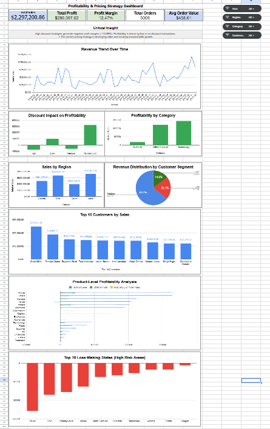
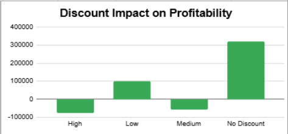
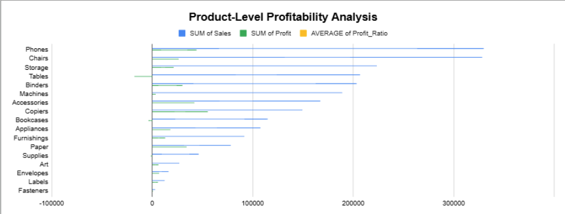
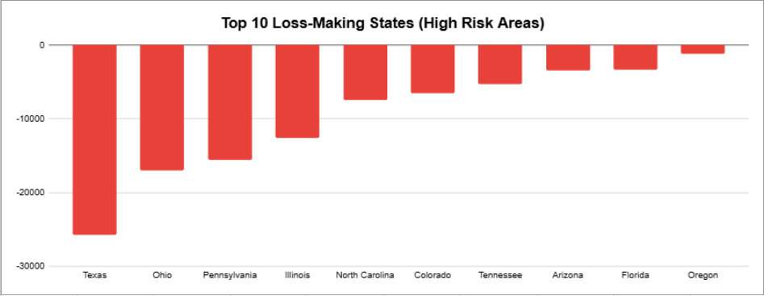
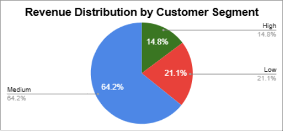

# 📊 Sales, Marketing & Revenue Profitability Analysis (Google Sheets)

## 🚀 Project Summary

This project uncovers a key structural issue in e-commerce performance:

👉 **Revenue growth is driven by discounting, but at the expense of profitability.**

Through data analysis and behavioral interpretation, this project explores how pricing strategy, customer segmentation, and perceived value interact to shape business performance.

---

## 📌 Business Context

An e-commerce company generates strong revenue but struggles with profitability.
The goal is to understand:

- How revenue is generated
- Why profitability remains low
- Where inefficiencies exist
- How to improve performance through data-driven strategy

---

## 🎯 Objectives

- Analyze revenue vs profitability dynamics  
- Evaluate the impact of discount strategies  
- Identify high-value customer segments  
- Assess regional and product performance  
- Translate insights into actionable business decisions  

---

## 📊 Data Overview

~25,000 total rows (5 months, ~5,000/month)
Source: Kaggle Superstore dataset

Key variables:

- Sales, Profit, Discount
- Product categories (Technology, Office Supplies, Furniture) & sub-category  
- Customer segments (Consumer, Corporate, Home Office)  
- Geographic performance (Region and State)  
- Order-level data  

---

## 🧹 Data Preparation & Feature Engineering

### Data Cleaning
- Standardized date formats  
- Cleaned customer names  
- Standardized product categories and sub-categories

### Feature Engineering
- Month / Year  
- Customer_Lifetime_Value (CLV)  
- Customer_Segment  
- Profit_Ratio  
- Order_Size  
- Profit_Status  

These transformations allow for deeper business and behavioral analysis.

### Data Validation
- Error_Check column to flag:
  - Sales ≤ 0  
  - Missing customer names  

---

## 📈 Key Metrics

- **Total Revenue:** $2,297,200.86  
- **Total Profit:** $286,397.02  
- **Profit Margin:** 12.03%  
- **Total Orders:** 5,009  
- **Average Order Value (AOV):** $458.61

---

## 📊 Dashboard Overview

This dashboard provides a complete view of revenue performance, profitability drivers, and business risks.
It highlights how discount strategies, customer behavior, and product performance impact overall profitability.

---

## 🔍 Key Insights

---

### 💸 Discount Impact on Profitability

Discount strategy is the primary driver of profitability loss:

- High discounts → **- $75,559 profit | -113.88% margin**  
- Medium discounts → **- $58,817 profit | -21.97% margin**  
- Low discounts → **$100,785 profit | 17.44% margin**  
- No discounts → **$320,987 profit | 34.02% margin**  

👉 Revenue growth is driven by discounting at the expense of profitability.

---

### 📦 Product-Level Profitability

Sub-category analysis reveals that high sales do not necessarily translate into high profit (for example, the sub-category: Tables, Bookcases and Supplies).
Several products operate at low or negative margins, indicating pricing inefficiencies or cost structure issues.

---

### ⚠️ Risk Identification

Some states consistently generate negative profit.

👉 These areas represent operational and financial risks requiring targeted strategic action.

---

### 👥 Customer Segment Performance

- Mid-value segment → **~$1.29M revenue | 11.49% margin** → drive most revenue
- High-value segment → **~$140K profit | 13.27% margin** → generate stronger profitability  
- Low-value segment → minimal contribution  

👉 Profitability is driven by value, not volume.

---

## 🧠 Behavioral Interpretation

---

### 🌍 Regional Performance
- West & East → highest performance  
- South & Central → underperform  

👉 Indicates differences in execution, targeting, or market conditions.

---

### 📅 Time-Based Analysis
Sales remain stable across the 5-month period.

👉 No strong seasonal variation observed.

---

## 🧠 Behavioral Interpretation

Beyond numerical performance, the data reveals clear customer behavior patterns:

- Heavy discount usage suggests price-sensitive purchasing behavior  
- High-value customers show more stable and profitable patterns  
- Mid-market segments are driven by volume rather than long-term value  

👉 This is not only a pricing issue, but a customer behavior and positioning challenge.

---

## ⚠️ Core Business Diagnosis

👉 The business appears to operate in a **“discount-driven growth loop”**:

- Sales volume increases through discounting  
- Profitability decreases as margins are reduced  

👉 This creates a structural inefficiency limiting long-term growth.

---

## 💡 Business Recommendations

### 🎯 Pricing Strategy
- Reduce high and medium discount levels  
- Apply discounts selectively on high-margin products  

### 👥 Customer Strategy
- Focus on high-value customers  
- Reduce dependency on discount-driven segments  

### 📦 Product Optimization
- Reassess low-profit products  
- Optimize pricing and cost structures  

### 🌍 Regional Strategy
- Invest in high-performing regions  
- Improve targeting in underperforming areas  

---

## 🧪 Testing Approach

- Test discount reduction strategies  
- Compare performance across segments  
- Evaluate targeting of high-value customers  
- Test retention and repeat purchase strategies  

---

## ⚖️ Business Considerations

- Reducing discounts may decrease sales volume but improve margins  
- Focusing on high-value customers may reduce volume but increase profitability  

---

## 🧠 Additional Perspective (CRM & Customer Experience)

From a CRM perspective, performance differences may be influenced by:

- Targeting strategy  
- Channel selection  
- Data quality  

Customer experience also plays a critical role. Even without immediate conversion, positive interactions can improve retention, engagement, and long-term value.

---

## 🧠 Personal Approach (Data × Marketing × Behavior)

This project reflects my approach to combining:

- Data analysis  
- Marketing strategy  
- Customer behavior understanding  

With a background in linguistics and computational analysis, I approach data not only as numbers, but as signals of human behavior, decision-making, and perception.

This allows me to:
- interpret patterns beyond surface-level metrics  
- connect data insights to customer psychology  
- understand how messaging, structure, and positioning influence performance  

Combined with hands-on CRM experience, I focus on translating data into actionable strategies aligned with real-world business operations.

---

## 🚀 Business Impact

Optimizing pricing and customer strategy could significantly improve profitability without increasing total revenue.

---

## 🧰 Tools Used

- Google Sheets  
- Data visualization
- Business analysis

---

## 🔗 Project Access

📊 Dashboard:  
https://docs.google.com/spreadsheets/d/1YhOCNmXWOkUpdLNnbfJdccVdRp_H8l0t3xKxZvTdnXw/edit?usp=sharing

💻 GitHub:  
https://github.com/CharlottePortenseigne/data-operations-portfolio.git  
